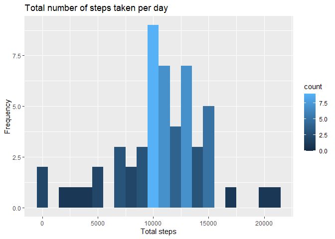
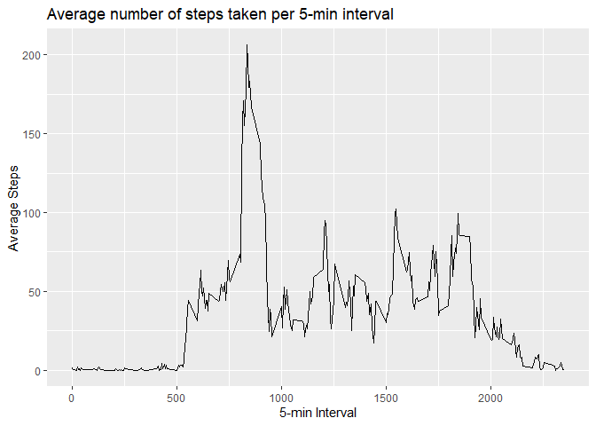
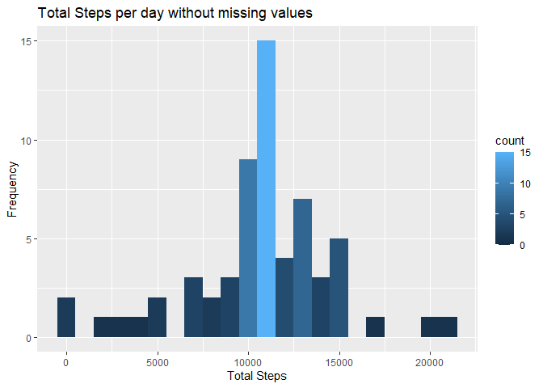
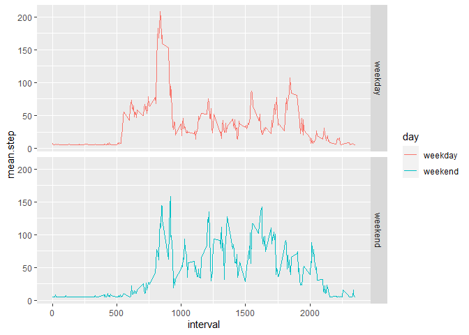

## Loading and preprocessing the data
1. Load the data:

```r
# Downloading the data, unzipping and reading it.Also loaded packages

library(dplyr)
```

```
## 
## Attaching package: 'dplyr'
```

```
## The following objects are masked from 'package:stats':
## 
##     filter, lag
```

```
## The following objects are masked from 'package:base':
## 
##     intersect, setdiff, setequal, union
```

```r
library(ggplot2)
library(knitr)

urldata <- "https://d396qusza40orc.cloudfront.net/repdata%2Fdata%2Factivity.zip"
download.file(urldata,destfile = "dataproject.zip",method = "curl")
unzip("dataproject.zip")
activity <- read.csv("activity.csv",na.strings = "NA")
```
2. Process/transform the data (if necessary) into a format suitable for your analysis

```r
# Changing date format 
activity$date <- as.Date(activity$date)
```

## What is mean total number of steps taken per day?
For this part of the assignment, you can ignore the missing values in the dataset.

1. Calculate the total number of steps taken per day

```r
# Creating a variable that only has the total steps taken per day

daily_steps <- aggregate(activity$steps,list(activity$date),FUN ="sum")
names(daily_steps) <- c("date","total_steps")
head(daily_steps)
```

```
##         date total_steps
## 1 2012-10-01          NA
## 2 2012-10-02         126
## 3 2012-10-03       11352
## 4 2012-10-04       12116
## 5 2012-10-05       13294
## 6 2012-10-06       15420
```
2. Make a histogram of the total number of steps taken each day

```r
plot_totalsteps <- ggplot(daily_steps,aes(total_steps)) + geom_histogram(binwidth = 1000,aes(y=..count..,fill=..count..)) + 
    labs(title="Total number of steps taken per day", x = "Total steps", y = "Frequency")
plot_totalsteps
```

```
## Warning: Removed 8 rows containing non-finite values (stat_bin).
```

<!-- -->

3. Calculate and report the mean and median of the total number of steps taken per day

```r
# Mean of the total number of steps taken per day
mean(daily_steps$total_steps,na.rm = TRUE)
```

```
## [1] 10766.19
```

```r
# Median of the total number of steps taken per day
median(daily_steps$total_steps,na.rm = TRUE)
```

```
## [1] 10765
```
Mean number of steps taken per day is **10766**.

Median number of steps taken per day is **10765**.

## What is the average daily activity pattern?

1. Make a time series plot (i.e. \color{red}{\verb|type = "l"|}type = "l") of the 5-minute interval (x-axis) and the average number of steps taken, averaged across all days (y-axis)

```r
# First we create a new variable that has the mean number of steps per interval
interval_steps <- aggregate(activity$steps, list(activity$interval),FUN="mean",na.rm=TRUE)
names(interval_steps) <- c("interval","average_steps")
# Now we plot the data
plot_interval_mean <- ggplot(interval_steps,aes(interval,average_steps)) + geom_line() + 
    labs(title = "Average number of steps taken per 5-min interval",x= "5-min Interval",y="Average Steps")
plot_interval_mean
```

<!-- -->

2. Which 5-minute interval, on average across all the days in the dataset, contains the maximum number of steps?

```r
interval_steps[interval_steps$average_steps == max(interval_steps$average_steps),]
```

```
##     interval average_steps
## 104      835      206.1698
```
The 5-min interval that contains the maximum number of steps is **8:35 with 206.17 steps**

## Imputing missing values
Note that there are a number of days/intervals where there are missing values (coded as \color{red}{\verb|NA|}NA). The presence of missing days may introduce bias into some calculations or summaries of the data.

1. Calculate and report the total number of missing values in the dataset (i.e. the total number of rows with  \color{red}{\verb|NA|}NAs)

```r
sum(is.na(activity$steps))
```

```
## [1] 2304
```
The number of rows with missing values is **2304**

2. Devise a strategy for filling in all of the missing values in the dataset. The strategy does not need to be sophisticated. For example, you could use the mean/median for that day, or the mean for that 5-minute interval, etc.


```r
#First we replicate the variable "activity", now we can work this variable without changing "activity". In "rep_activity", we change the missing values for the historic mean.
rep_activity <- activity
rep_activity[is.na(rep_activity$steps),"steps"] <- mean(rep_activity$steps,na.rm=TRUE)
```

3. Create a new dataset that is equal to the original dataset but with the missing data filled in.

```r
#The dataset was already created in the last point.
summary(rep_activity)
```

```
##      steps             date               interval     
##  Min.   :  0.00   Min.   :2012-10-01   Min.   :   0.0  
##  1st Qu.:  0.00   1st Qu.:2012-10-16   1st Qu.: 588.8  
##  Median :  0.00   Median :2012-10-31   Median :1177.5  
##  Mean   : 37.38   Mean   :2012-10-31   Mean   :1177.5  
##  3rd Qu.: 37.38   3rd Qu.:2012-11-15   3rd Qu.:1766.2  
##  Max.   :806.00   Max.   :2012-11-30   Max.   :2355.0
```

4. Make a histogram of the total number of steps taken each day and Calculate and report the mean and median total number of steps taken per day. Do these values differ from the estimates from the first part of the assignment? What is the impact of imputing missing data on the estimates of the total daily number of steps?

```r
# First we create a new variable that has the total steps per day
daily_steps_rep <- aggregate(rep_activity$steps,list(rep_activity$date),FUN ="sum")
names(daily_steps_rep) <- c("date","total_steps")

#Plot of the total number of steps taken each day
plot_steps_rep <- ggplot(daily_steps_rep,aes(total_steps)) + geom_histogram(binwidth = 1000,aes(y=..count..,fill=..count..)) +
    labs(title="Total Steps per day without missing values",x="Total Steps",y="Frequency")
plot_steps_rep
```

<!-- -->

```r
#Mean of steps per day
mean(daily_steps_rep$total_steps)
```

```
## [1] 10766.19
```

```r
#Median of steps per day
median(daily_steps_rep$total_steps)
```

```
## [1] 10766.19
```
The mean and median of steps per day is **10766.19**

## Are there differences in activity patterns between weekdays and weekends?

For this part the \color{red}{\verb|weekdays()|}weekdays() function may be of some help here. Use the dataset with the filled-in missing values for this part.

1. Create a new factor variable in the dataset with two levels – “weekday” and “weekend” indicating whether a given date is a weekday or weekend day.


```r
rep_activity$day <- ifelse(weekdays(rep_activity$date) %in% c("sábado","domingo"),"weekend","weekday")
rep_df <- rep_activity %>% group_by(interval,day) %>% summarise(mean.step=mean(steps))
```

```
## `summarise()` has grouped output by 'interval'. You can override using the `.groups` argument.
```

2. Make a panel plot containing a time series plot (i.e. \color{red}{\verb|type = "l"|}type = "l") of the 5-minute interval (x-axis) and the average number of steps taken, averaged across all weekday days or weekend days (y-axis). See the README file in the GitHub repository to see an example of what this plot should look like using simulated data.


```r
plot_day_interval <- ggplot(rep_df,aes(interval,mean.step,color=day)) + facet_grid(day~.) + geom_line()
plot_day_interval
```

<!-- -->
